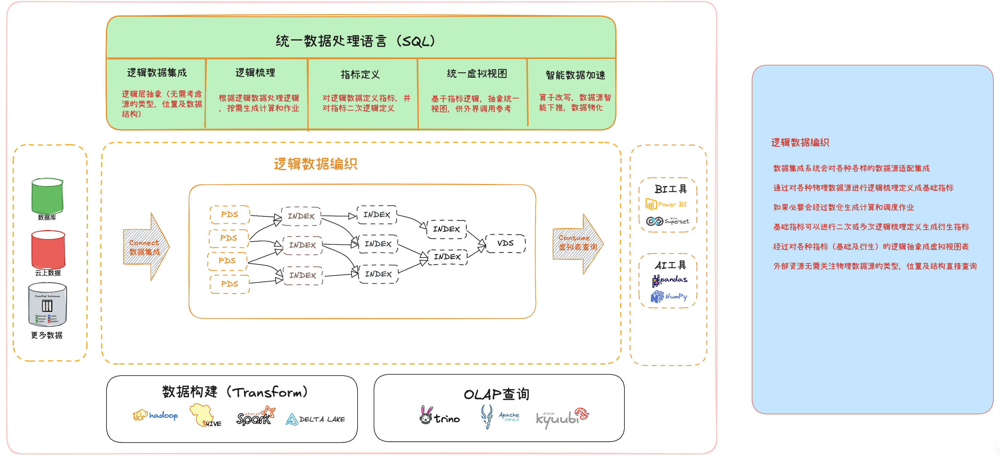

# Unified Data Service / 统一数据服务

[](https://www.oracle.com/java/technologies/javase/jdk17-archive-downloads.html)
[](https://spring.io/projects/spring-boot)
[](https://opensource.org/licenses/Apache-2.0)

## 📖 概述 / Overview

**统一数据服务 (Unified Data Service)** 是一个高性能、配置驱动的Java数据集成平台。它旨在解决企业在面对异构数据源（如JSON、CSV、数据库等）时遇到的数据孤岛问题。通过将不同来源的数据实时转化为标准化的 **Apache Arrow** 内存格式，并提供统一的 **SQL查询** 和 **指标访问** 接口，可快速将新的数据资产纳入平台，并通过标准SQL进行连接、过滤和聚合查询，可以为text2sql大模型定义业务垂类语义视图层的和统一的数据访问接口。

**Unified Data Service** is a high-performance, configuration-driven Java data integration platform. It aims to solve the data silo problem that enterprises encounter when facing heterogeneous data sources (such as JSON, CSV, databases, etc.). By converting data from different sources into the standardized **Apache Arrow** memory format in real time and providing a unified **SQL query** and **metric access** interface, new data assets can be quickly incorporated into the platform, and connected, filtered, and aggregated queries can be performed through standard SQL. It can define a business vertical semantic view layer and a unified data access interface for the text2sql large model.




## ✨ 核心优势 / Key Features

- **配置驱动 / Configuration-Driven**
  - 无需修改代码，仅通过在数据库中添加元数据定义，即可动态接入新的数据指标
  - No code changes needed, dynamically integrate new data metrics by adding metadata definitions to the database

- **SQL 查询接口 / SQL Query Interface**
  - 支持标准 SQL 语法查询逻辑表数据
  - Supports standard SQL syntax for querying logical tables
  - 自动将 SQL 查询转换为底层指标查询计划
  - Automatically translates SQL queries to underlying metric query plans

- **逻辑表抽象 / Logical Table Abstraction**
  - 将多个指标组织为逻辑表，支持表连接和复杂查询
  - Organizes multiple metrics into logical tables with support for joins and complex queries
  - 支持按时间和代码分区，优化查询性能
  - Supports partitioning by time and code for optimized query performance

- **高性能 / High Performance**
  - 使用 Apache Arrow 进行高效的内存列式数据处理
  - Efficient in-memory columnar data processing with Apache Arrow
  - 基于 Caffeine 的缓存层，提高重复查询性能
  - Caffeine-based caching layer for improved performance on repeated queries
  - 流式处理大型结果集，降低内存占用
  - Streaming of large result sets to reduce memory footprint

- **统一与标准化 / Unification & Standardization**
  - 将多格式的外部数据源统一清洗为标准化的中间数据结构
  - Unify and clean multi-format data sources into standardized intermediate data structures


## 🚀 快速开始 / Quick Start

### 环境要求 / Prerequisites

- Java 17 或更高版本 / JDK 17 or later
- Apache Maven 3.6+
- Node.js 16+ (for frontend)
- npm 7+ (for frontend)

### 服务启动流程 / Service Startup Process

#### 1. 后端服务启动 / Backend Service Startup

```bash
# 使用 Maven Wrapper (推荐)
./mvnw spring-boot:run

# 或者直接使用 Maven
# mvn spring-boot:run
```

后端服务将在 `http://localhost:8080` 启动
The backend service will start at `http://localhost:8080`

#### 2. 前端服务启动 / Frontend Service Startup

```bash
# 进入前端目录
cd frontend

# 安装依赖
npm install

# 启动开发服务器
npm run dev
```

前端服务将在 `http://localhost:5173` 启动
The frontend service will start at `http://localhost:5173`

### 服务访问地址 / Service Access URLs

- 后端 API: `http://localhost:8080`
- 前端界面: `http://localhost:5173`

## 📚 技术栈 / Tech Stack

- **核心框架 / Core Framework**
  - Java 17 (Required for parameter name retention in Spring Cache)
  - Spring Boot 3.2.5
  - Spring Cache with Caffeine (with parameter name retention enabled)
  - Spring Data JPA
  - Spring Cache (Caffeine)
  - JSqlParser (SQL 解析)

- **数据处理 / Data Processing**
  - Apache Arrow 15.0.0 (列式存储与处理 / Columnar storage and processing)
  - Field type mapping support for logical tables
  - Jackson (JSON 处理 / JSON processing)
  - Apache Commons CSV (CSV 处理 / CSV processing)

- **数据库 / Database**
  - H2 (内存数据库 / In-memory)
  - Spring Data JPA

- **工具 / Tools**
  - Lombok
  - JUnit 5
  - Mockito
  - Spring Boot Actuator

## 🔍 API 文档 / API Documentation

### 1. 获取指标数据 / Get Metric Data

- **URL**: `GET /api/metrics/{metricName}`
- **Response**: `text/csv`

#### 参数 / Parameters

| 参数 / Parameter | 类型 / Type | 必填 / Required | 描述 / Description |
|----------------|------------|----------------|-------------------|
| metricName     | Path       | 是 / Yes       | 指标名称 / Metric name (e.g., `user_signups`, `system_load`) |
| filter         | Query      | 否 / No        | 过滤表达式 / Filter expression (e.g., `age > 30`, `region == 'US'`) |

### 2. 执行 SQL 查询 / Execute SQL Query

- **URL**: `GET /api/query`
- **Response**: `application/json` 或 `application/vnd.apache.arrow.stream`

#### 参数 / Parameters

| 参数 / Parameter | 类型 / Type | 必填 / Required | 描述 / Description |
|----------------|------------|----------------|-------------------|
| sql            | Query      | 是 / Yes       | SQL 查询语句 / SQL query statement |
| format         | Query      | 否 / No        | 响应格式: `json` 或 `arrow` (默认为 `arrow`) / Response format: `json` or `arrow` (default: `arrow`)

#### 操作符 / Operators
- 比较: `==`, `!=`, `>`, `<`, `>=`, `<=`
- 字符串值必须用单引号括起来 / String values must be enclosed in single quotes
- 数值不需要引号 / Numeric values should not be quoted

#### SQL 查询示例 / SQL Query Examples

```sql
-- 查询股票日线数据
SELECT * FROM stock_daily WHERE code = '000001.SZ' AND trade_date >= '2023-01-01';

-- 多表连接查询
SELECT a.code, a.trade_date, a.close, b.volume 
FROM stock_daily a 
JOIN stock_volume b ON a.code = b.code AND a.trade_date = b.trade_date
WHERE a.code IN ('000001.SZ', '600000.SH');

-- 聚合查询
SELECT code, AVG(close) as avg_price, SUM(volume) as total_volume
FROM stock_daily
WHERE trade_date BETWEEN '2023-01-01' AND '2023-12-31'
GROUP BY code
HAVING AVG(close) > 10.0;

-- 多数据源指标定义的视图表
SELECT ticker, date, volume, price FROM stock_quote WHERE ticker = 'AAPL' AND date = 1672531200000;
```

#### 流式响应 / Streaming Response

对于大型结果集，API 支持流式响应（使用 Apache Arrow 格式）:

```bash
# 获取 Arrow 格式的流式响应
curl -H "Accept: application/vnd.apache.arrow.stream" "http://localhost:8080/api/query?sql=SELECT * FROM large_table" > results.arrow

# 使用 Python 读取流式响应
import pyarrow as pa
import requests

response = requests.get(
    'http://localhost:8080/api/query',
    params={'sql': 'SELECT * FROM large_table'},
    headers={'Accept': 'application/vnd.apache.arrow.stream'},
    stream=True
)

with pa.ipc.open_stream(response.raw) as reader:
    for batch in reader:
        df = batch.to_pandas()
        # 处理批次数据 / Process batch data
        print(df)
```

#### 示例 / Examples

```bash
# 获取未过滤的数据 / Get unfiltered data
curl http://localhost:8080/api/metrics/user_signups

# 获取年龄大于30的用户数据 / Get users older than 30
curl "http://localhost:8080/api/metrics/sample_json_metric?filter=age > 30"

# 获取美国地区用户数据 / Get users from US region
curl "http://localhost:8080/api/metrics/sample_json_metric?filter=region == 'US'"
```

## 📜 更新日志 / Changelog

### [Unreleased]
#### Fixed
- **解决了后端服务无法启动的严重问题**：通过重构Apache Arrow的内存管理机制，创建了一个由Spring统一管理的`RootAllocator`，并更新了所有相关服务（`MetricService`, `JsonDataParser`, `CsvDataParser`, `ArrowJoinUtil`, `SqlQueryService`），确保内存分配的统一和稳定，从而解决了因内存分配器冲突导致的启动失败问题。

#### Added
- 实现了指标、逻辑表和SQL查询的完整CRUD和查询API。
- 增加了对CSV和JSON两种数据源的解析能力。
- 实现了基于Apache Arrow的内存数据表和表连接功能，以支持高性能的即席查询。

#### Changed
- 将多个使用Apache Arrow的工具类（如`ArrowJoinUtil`）和服务重构为Spring管理的组件，以实现依赖注入和统一的生命周期管理。


## 📄 许可证 / License

This project is licensed under the Apache License 2.0 - see the [LICENSE](LICENSE) file for details.

## 🤝 贡献 / Contributing

欢迎提交问题和拉取请求！请确保您的代码符合项目编码标准，并包含适当的测试。

Issues and pull requests are welcome! Please ensure your code follows the project's coding standards and includes appropriate tests.

### 获取指标数据

-   **URL**: `/api/metrics/{metricName}`
-   **方法**: `GET`
-   **返回格式**: `text/csv`
-   **描述**: 获取指定指标的数据，处理后以 CSV 文件形式返回。

#### 请求示例

你可以使用浏览器或 `curl` 等工具，通过预置的样本指标来测试服务：

```bash
curl http://localhost:8080/api/metrics/sample_json_metric
```

#### 响应示例

响应将是一个 CSV 格式的字符串:

```csv
stock_code,event_time,metric_field_1,metric_field_2
000001.SZ,1733414400000,value1,value2
300033.SZ,1733414400000,value1,value2
```

## 如何扩展

### 添加新指标

要从一个已支持的数据源类型（如另一个 JSON API）添加新指标：

1.  在 `METRIC_INFO` 表中插入一条新记录。你可以通过数据库客户端操作，或扩展 `DataInitializer` 来实现。
2.  提供以下信息:
    -   `name`: 指标的唯一名称 (例如, `my_new_metric`).
    -   `source_type`: `HTTP_JSON` 或 `HTTP_CSV`.
    -   `source_url`: 数据源的 URL.
    -   `data_path`: (仅用于 JSON) 指向数据数组的 JSONPath (例如, `/results/data`).
    -   `field_mappings`: 一个 JSON 字符串，用于映射源字段到目标字段名和类型 (例如, `{"id":"user_id:LONG", "val":"metric_value:DOUBLE"}`).

### 添加新数据源类型

要支持一种新的数据格式（如 XML）:

1.  在 `pom.xml` 中添加所需的解析库。
2.  在 `DataSourceType` 枚举中创建一个新值 (例如, `HTTP_XML`).
3.  创建一个实现 `DataParser` 接口的新解析器类 (例如, `XmlDataParser.java`).
4.  使用 `@Component("HTTP_XML")` 注解你的新解析器。注解中的字符串必须与新枚举值的 `name()` 匹配。
5.  实现 `parse` 方法，将 `InputStream` 转换为 `UnifiedDataTable`。

当 `MetricService` 遇到相应 `sourceType` 的 `MetricInfo` 记录时，它会自动发现并使用你的新解析器。

